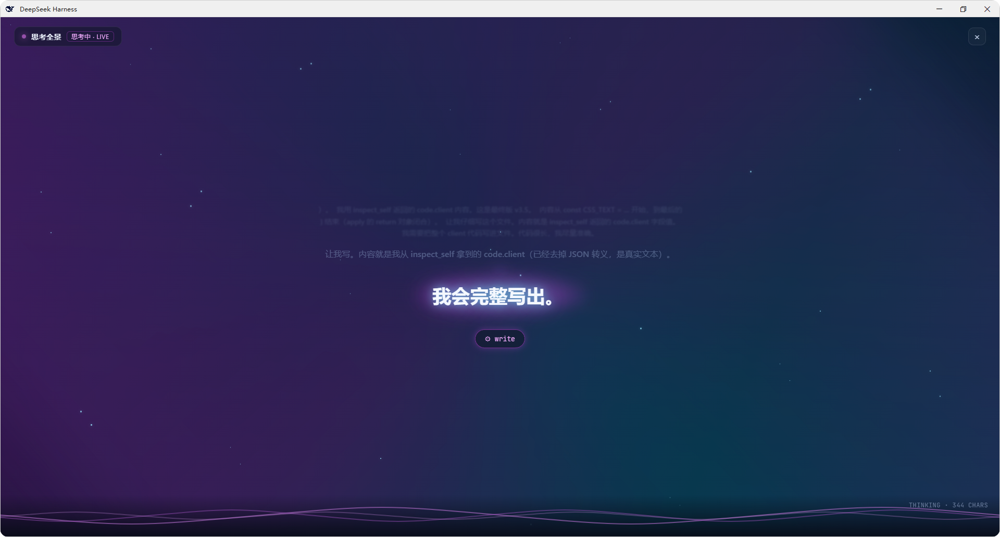

# DSH 思考全景（Thinking Fullscreen）v1.0

DSH 对话过程中，一键切换到全屏沉浸层，实时可视化 AI 的思考流与工具调用过程，配合科技感动态背景（流体渐变、霓虹光斑、星尘、流动波浪线），类似桌面歌词的全屏观感。



## 功能清单

| 类别 | 内容 |
|------|------|
| 入口 | 会话顶栏「◉ 思考全景」按钮 |
| 全屏 | 浏览器原生 Top Layer（dialog），无视 z-index；ESC / × / 再点按钮退出 |
| 内容五态 | 思考流 / 工具执行（卡+参数） / 回答流 / 上轮回顾（RECAP） / 空态 |
| 分层景深 | 最新行最大最亮 + 霓虹背景光斑，上行逐级缩淡，更早内容折叠为模糊残影 |
| 动态背景 | 5 段色带流动渐变 + conic 光斑旋转 + 48 颗星尘上浮，随状态变色变速 |
| 底部波浪 | 3 层 SVG 正弦波无缝流动，思考时加速换品红、空闲时舒缓 |
| 交互 | 自动滚底、隐藏滚动条、光标闪烁、markdown 清洗 |
| 性能 | 动画全 CSS/GPU 合成，零 JS 逐帧；空闲波浪降速省资源 |

## 安装

从 GitHub 在线安装到 web profile：

```powershell
dsh plugin --profile web add github:746964750/dsh-thinking-fullscreen
dsh web
```

等价写法：`dsh plugin --profile web add https://github.com/746964750/dsh-thinking-fullscreen.git`

卸载：`dsh plugin --profile web remove @deepseek-ai/dsh-thinking-fullscreen`

## 数据通路

```
conversation.composer.dock（数据桥）
  └─ ConversationSnapshot.partial.blocks
       ├─ reasoning → 思考流渲染
       └─ tool-call + runningCalls → 工具卡
  → 内存 store → shell.overlay 覆盖层订阅渲染
```

全程走 Slot 标准 props，无 Host RPC 绕行。

## 版本

- 当前：`1.0.1`（见 `package.json`）
- dshmarket 对 `github:` 安装按 **锁定 commit ≠ 仓库 HEAD** 提示更新；发版请 bump `package.json` 的 `version` 后推送 `main`
- 设计文档见 DESIGN.md
